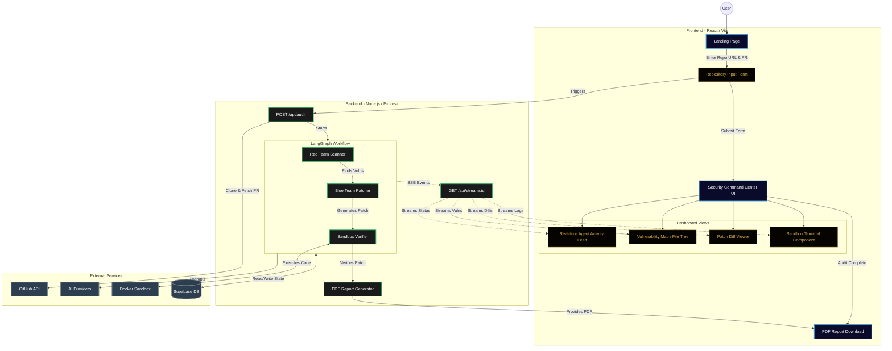

# Aegis Swarm Sitemap & User Flow

This flowchart represents the frontend structure, user journey, and backend interactions of the Aegis Swarm Security Command Center.

```mermaid
graph TD
    %% User Entry Point
    Start((User)) --> Home

    %% Frontend Pages & Components
    subgraph Frontend [Frontend - React / Vite]
        Home[Landing Page]
        InputForm[Repository Input Form]
        
        Dashboard[Security Command Center UI]
        
        subgraph DashboardComponents [Dashboard Views]
            ActivityFeed[Real-time Agent Activity Feed]
            VulnMap[Vulnerability Map / File Tree]
            DiffViewer[Patch Diff Viewer]
            SandboxTerm[Sandbox Terminal Component]
        end
        
        PDFDownload[PDF Report Download]
    end

    %% Routing
    Home -->|Enter Repo URL & PR| InputForm
    InputForm -->|Submit Form| Dashboard
    
    Dashboard --> ActivityFeed
    Dashboard --> VulnMap
    Dashboard --> DiffViewer
    Dashboard --> SandboxTerm
    Dashboard -->|Audit Complete| PDFDownload

    %% Backend API & Workflows
    subgraph Backend [Backend - Node.js / Express]
        API_Audit[POST /api/audit]
        API_Stream[GET /api/stream/:id]
        
        subgraph LangGraph [LangGraph Workflow]
            RedTeam[Red Team Scanner]
            BlueTeam[Blue Team Patcher]
            Sandbox[Sandbox Verifier]
        end
        
        ReportGen[PDF Report Generator]
    end

    %% Interactions
    InputForm -->|Triggers| API_Audit
    API_Audit -->|Starts| LangGraph
    
    RedTeam -->|Finds Vulns| BlueTeam
    BlueTeam -->|Generates Patch| Sandbox
    Sandbox -->|Verifies Patch| ReportGen
    ReportGen -->|Provides PDF| PDFDownload

    %% Real-time Updates
    LangGraph -.->|SSE Events| API_Stream
    API_Stream -.->|Streams Status| ActivityFeed
    API_Stream -.->|Streams Vulns| VulnMap
    API_Stream -.->|Streams Diffs| DiffViewer
    API_Stream -.->|Streams Logs| SandboxTerm

    %% External Services
    subgraph External [External Services]
        GitHub[GitHub API]
        LLM[AI Providers]
        Docker[Docker Sandbox]
        Supabase[(Supabase DB)]
    end

    %% External Interactions
    API_Audit -->|Clone & Fetch PR| GitHub
    LangGraph -->|Prompts| LLM
    Sandbox <-->|Executes Code| Docker
    LangGraph <-->|Read/Write State| Supabase

    %% Styling
    classDef page fill:#0a0a2a,stroke:#3498db,stroke-width:2px,color:#fff;
    classDef component fill:#060400,stroke:#c9a84c,stroke-width:1px,color:#d4a843;
    classDef backend fill:#1a1a1a,stroke:#27ae60,stroke-width:2px,color:#fff;
    classDef external fill:#2c3e50,stroke:#7f8c8d,stroke-width:2px,color:#fff;

    class Home,Dashboard,PDFDownload page;
    class InputForm,ActivityFeed,VulnMap,DiffViewer,SandboxTerm component;
    class API_Audit,API_Stream,RedTeam,BlueTeam,Sandbox,ReportGen backend;
    class GitHub,LLM,Docker,Supabase external;
```
